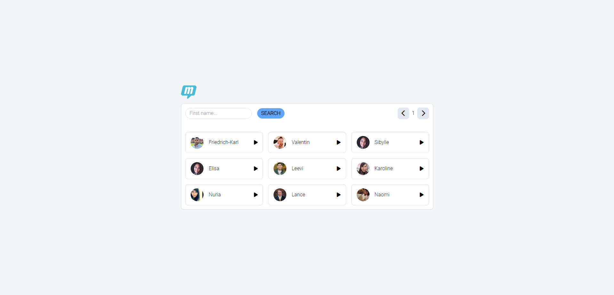
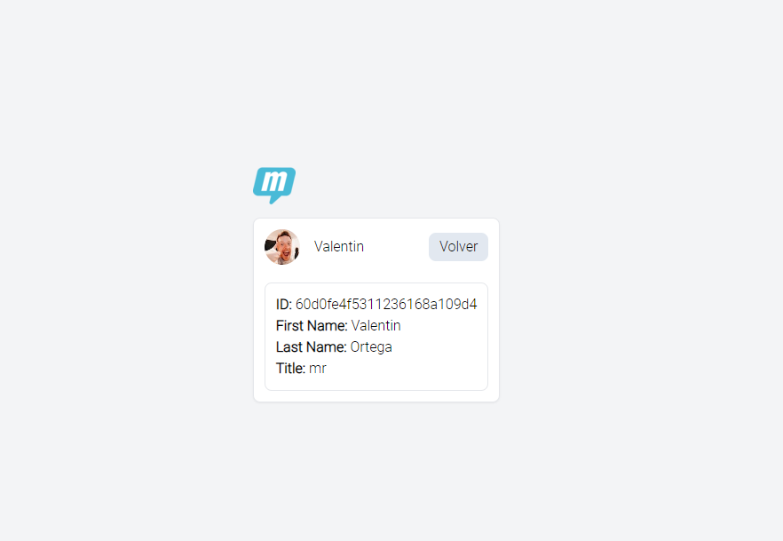

# Frontend challenge MailUp




##  How to Run
```bash
npm install && npm run dev
cp .env.example .env 
```
You **MUST** fill the "VITE_DUMMY_API_TOKEN" in .env for this to work.
<br>
Api token example: 6479572de9806d3affb4f0f1